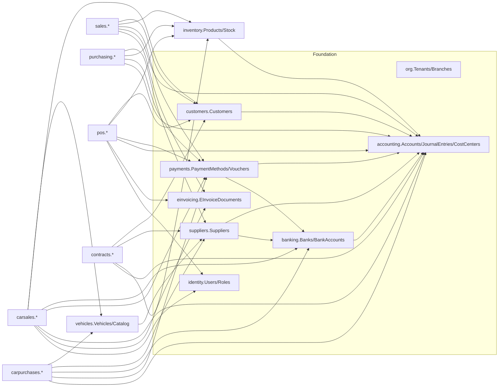

# ERP Backend — Modular Architecture Report (Phase 1: Analysis & Design)

> Source of truth: the Angular 19 frontend at `D:\SystemErp` (surveyed 2026-09-24).
> Status: **design only — no backend code written yet.**
> This document supersedes `BACKEND_IMPLEMENTATION_PLAN.md` and `BACKEND_FRONTEND_MAPPING.md` where they conflict (see §17.1).

---

## 0. Executive summary

**What the frontend really is.** About 33k lines of TypeScript. Business logic, numbering, VAT, totals and journal posting all run in the browser, in Angular signals seeded with demo data. The only real HTTP calls are the 6 auth endpoints in `auth.service.ts`, and each falls back to `localStorage` when the server is down. Permissions, approvals and notifications are also kept in `localStorage`. **The backend is effectively greenfield. The frontend's models, workflows and rules are the specification.**

**The five findings that shape this design most:**

1. **The frontend already separates the domains the way you want.** Car sales (`CarSalesContract`, `CarInvoiceRecord`, car quotations, returns, installments), car purchases (`CarProcurementOrder`, `CarPurchaseInvoice`, …), POS (`PosTransaction`, shifts, loyalty, …) and general sales and purchases each have their own models. But the UI also copies car invoices and POS sales into the general `invoices` list. The backend keeps them separate and builds a combined sales register as a read-only report view.
2. **The existing `ERP.sln` backend follows the opposite design**: one shared `Invoice` table for general, car and POS sales, flat layers, and `CarAgent` as its own party type. I recommend a new modular solution, reusing selected code from the old one (§17.1).
3. **Account codes are inconsistent** across the frontend. For example, output VAT is `212` in the chart of accounts, `213` in contract/delivery-note posting and `2104` in car-invoice posting. Receivables use `112` and `1103`; revenue uses `41`, `411` and `4101`. Accounting must post through a configurable **posting-account mapping**, never through fixed codes.
4. **Some key rules aren't enforced anywhere.** The same VIN can be sold twice (the seed data already has `veh-1` in two contracts and `veh-2` in two contracts). Sales and purchases never write stock movements. Document numbers come from `Date.now()`/`Math.random()`. Passwords sit in plain text in `localStorage`.
5. **Several things have two copies.** There are 6 invoice shapes, 2 item masters (`ProductItem` and a legacy `ItemMaster` still used by the routed Agreements and Orders screens), `CarAgent` next to `Supplier`, 2 ZATCA config objects, and 3 car-color representations. §14 lists them all with a resolution for each.

**Proposed shape.** A modular monolith on ASP.NET Core 9 and EF Core 9 with SQL Server, one database, **one schema per module**, and one `DbContext` per module sharing a single connection and transaction. There are 22 modules in 6 groups. Modules may reference only each other's `*.Contracts` project, and architecture tests enforce this. Accounting receives the financial effect of each business document through `IAccountingPostingService`, inside the same transaction as the document.

**Decisions I need from you** are collected in **Appendix A**, 13 items. The most important: rebuild vs. refactor (A1), Branch/Showroom scope (A2), and used-car VAT rules (A3).

---

## 1. Frontend modules

| # | Area (route prefix) | Frontend services used | Routed? |
|---|---|---|---|
| 1 | Dashboard (`/dashboard`) | ErpService, CarShowroomService | ✅ |
| 2 | Master data (`/master-data/*`): customers, suppliers, banks, items, payment-methods, categories, units, car-colors | ErpService, CarShowroomService | ✅ |
| 3 | General Sales (`/sales/*`): invoices, quotations, returns, agreements, delivery-notes | ErpService, ApprovalService, PermissionService | ✅ |
| 4 | POS (`/pos`), with 13 sub-tabs: sales, shift open/close, discounts, loyalty, coupons, returns, items, customers, reprint, invoice settings, ZATCA settings, invoice type | ErpService | ✅ |
| 5 | General Purchases (`/purchases/standard`, `/standard/returns`, `/requisitions`, `/agreements`, `/delivery-notes`) | ErpService | ✅ |
| 6 | Car Purchases (`/purchases/cars/invoices`, `/purchases/cars/returns`) | ErpService, CarShowroomService | ✅ |
| 7 | Agreements, Orders, Contracts, Delivery Notes (`/agreements`, `/orders`, `/contracts`, `/delivery-notes`) | **legacy** `services/erp.service.ts` (agreements, orders) + core ErpService | ✅ |
| 8 | Accounting & Finance (`/accounts-tree`, `/vouchers`, `/cost-centers`, `/fixed-assets`) | ErpService | ✅ |
| 9 | Tax / ZATCA (`/zatca-integration`) | ErpService | ✅ |
| 10 | Settings (`/profile`, `/permissions`, `/costing`) | AuthService, PermissionService, ErpService | ✅ |
| 11 | Reports (`/reports`) + advanced car reports | ReportsExpandedService, ErpService, CarShowroomService | ✅ |
| 12 | Car Showroom (`/showroom`, `/showroom/{vehicles,procurement,sales,invoices,reports}`, `/showroom/procurement/stage/:stageId`, `/showroom/contracts/stage/:stageId`) | CarShowroomService, ErpService | ✅ |
| 13 | Support (`/support`) | local only | ✅ |
| 14 | Auth (login, register-company) | AuthService (**real HTTP**) | shown by the app shell, not the router |
| — | Unrouted or orphaned: `approval-policies` (the approval **engine** is live from Sales, but the policy screen can't be reached), `commercial-contracts`, `subscriptions`, `dictionary`, `backend-architecture` (dev tool), `item-master`, `purchases/invoices/purchases.component`, `purchases/returns/purchase-returns.component` | | ❌ |

Two mode switches live in `localStorage`: `erp_car_showroom_active` and `erp_pos_active`. In the backend these become **module enablement per tenant**.

---

## 2. Screens → service → module → entity → backend service → API (master map)

| Frontend screen | Frontend service call(s) | Backend module | Backend entities | Backend service (contract) | API endpoint |
|---|---|---|---|---|---|
| login | `AuthService.login/requestPasswordResetOtp/verifyResetOtp/resetPassword/users` | Identity | User, RefreshToken, PasswordResetRequest | `IAuthService` | `POST /api/v1/auth/login`, `/auth/forgot-password/{request,verify-otp,reset}`, `GET /auth/users` |
| register-company | `AuthService.registerCompany` | Organization + Identity + Accounting (seed chart of accounts) | Tenant, TenantSubscription, User | `ITenantProvisioningService` | `POST /api/v1/auth/register-company` |
| profile | `AuthService.updateUserProfile` | Identity | User | `IUserService` | `PUT /api/v1/users/me` |
| permissions | `PermissionService.get/savePermissionsForUserOrRole`, `hasPermission` | Permissions | Screen, RoleScreenPermission, UserScreenPermission | `IPermissionService` | `GET/PUT /api/v1/permissions/roles/{role}`, `/permissions/users/{id}`, `GET /permissions/me` |
| dashboard | many signals | Reports | (views) | `IDashboardQueries` | `GET /api/v1/dashboard/stats`, `/dashboard/recent-activity` |
| master-data/customers | `addCustomer/updateCustomer/deleteCustomer/createAccountForCustomer` | Customers | Customer | `ICustomerService` → `IAccountProvisioning` | `/api/v1/customers`, `POST /customers/{id}/account` |
| master-data/suppliers | `addSupplier/…/createAccountForSupplier` | Suppliers | Supplier, SupplierBankDetail | `ISupplierService` | `/api/v1/suppliers`, `POST /suppliers/{id}/account` |
| master-data/banks | `addBank/updateBank/deleteBank/createAccountForBank` | Banking | Bank, BankAccount | `IBankAccountService` | `/api/v1/banks`, `/api/v1/bank-accounts`, `POST /bank-accounts/{id}/account` |
| master-data/payment-methods | `add/update/deletePaymentMethod` | Payments | PaymentMethod | `IPaymentMethodService` | `/api/v1/payment-methods` |
| master-data/items (product mode) | `addProduct/updateProduct/deleteProduct` | Inventory | Product, StockBalance | `IProductService` | `/api/v1/products` |
| master-data/items (car mode) | `CarShowroomService.addVehicle/…` + **`ErpService.addProduct` (copies the vehicle into Products — dropped)** | Vehicles | Vehicle | `IVehicleService` | `/api/v1/vehicles` |
| master-data/categories | `add/update/deleteCategory` | Inventory | ProductCategory | `ICategoryService` | `/api/v1/product-categories` |
| master-data/units | `add/update/deleteUnit` | Inventory | UnitOfMeasure | `IUnitService` | `/api/v1/units` |
| master-data/car-colors | `add/removeExteriorColor`, `add/removeInteriorColor` | Vehicles | CarColor | `ICatalogService` | `/api/v1/vehicles/colors` |
| sales/invoices | `createSalesInvoice`, `deleteInvoice`, `simulateZatcaSend`, `ApprovalService.checkAndCreateApprovalRequest` | Sales | SalesInvoice(+Lines, Payments) | `ISalesInvoiceService` → Inventory, Accounting, EInvoicing, Workflow | `/api/v1/sales/invoices`, `POST …/{id}/post`, `…/{id}/einvoice/submit` |
| sales/quotations | `addQuotation/updateQuotation/deleteQuotation/convertQuotationToSalesInvoice` | Sales | SalesQuotation(+Lines) | `ISalesQuotationService` | `/api/v1/sales/quotations`, `POST …/{id}/convert-to-invoice` |
| sales/returns | `createInvoiceReturn` | Sales | SalesNote (credit/debit) | `ISalesNoteService` | `/api/v1/sales/credit-notes` |
| pos | `openPosShift/closePosShift/completePosCheckout/validateAndApplyCoupon/redeemLoyaltyPoints/saveHeldCart/removeHeldCart/processPosReturn/submitPosTransactionToZatca/updatePosInvoiceSettings` | POS | PosShift, PosTransaction, PosReturn, PosHeldCart, PosCoupon, PosOffer, LoyaltyAccount, PosSettings | `IPosCheckoutService`, `IPosShiftService`, `ILoyaltyService`, `ICouponService` | `/api/v1/pos/*` (§12) |
| purchases/standard | `addPurchaseInvoice`, `addSupplier` | Purchasing | PurchaseInvoice(+Lines, Payments) | `IPurchaseInvoiceService` | `/api/v1/purchases/invoices` |
| purchases/standard/returns | reads `purchaseInvoices`, local `PurchaseReturn` | Purchasing | PurchaseReturn(+Lines) | `IPurchaseReturnService` | `/api/v1/purchases/returns` |
| purchases/requisitions | `add/update/deletePurchaseRequisition`, `convertRequisitionToPurchaseInvoice` | Purchasing | PurchaseRequisition(+Lines) | `IRequisitionService` | `/api/v1/purchases/requisitions`, `POST …/{id}/{submit,approve,reject,convert-to-invoice}` |
| purchases/cars/invoices | local `carPurchaseInvoices`, `carPurchaseQuotations`, `carPurchaseReturns`, `supplierInstallments`; `showroomService.addVehicle` | CarPurchases | CarPurchaseInvoice, CarPurchaseQuotation, CarPurchaseReturn, SupplierInstallmentPlan | `ICarPurchaseInvoiceService` → Vehicles, Accounting, Payments | `/api/v1/car-purchases/{invoices,quotations,returns,installments}` |
| purchases/cars/returns | local `any[]` | CarPurchases | CarPurchaseReturn | same | `/api/v1/car-purchases/returns` |
| showroom/procurement + stage/:stageId | `createProcurementOrder/advanceProcurementStage/addVehicle/updateVehicle` | CarPurchases | CarProcurementOrder(+Lines, Shipment, Receipts, StageHistory) | `IProcurementService` | `/api/v1/car-purchases/procurement-orders`, `POST …/{id}/advance` |
| showroom/vehicles | `add/updateVehicle`, `addBrand/Agent/Model/Trim/Year`, `calculateVat` | Vehicles | Vehicle, CarBrand, BrandAgent, CarModel, CarTrim, CarModelYear | `IVehicleService`, `ICatalogService` | `/api/v1/vehicles/*` |
| showroom/sales + contracts/stage/:stageId | `createSalesContract/updateContractStatus/deleteSalesContract`, `calculateVat` | CarSales | CarSalesContract (+Financing, Registration, Insurance, Warranty, Accessories, Handover) | `ICarSalesContractService` → Vehicles, Customers, Payments | `/api/v1/car-sales/contracts`, `POST …/{id}/{approve,allocate,deliver,invoice,cancel}` |
| showroom/invoices(/:type) | local `carInvoices/carQuotations/carSalesReturns/installments`; writes `erpService.invoices/journalEntries/vouchers` directly | CarSales | CarSalesInvoice, CarQuotation, CarSalesReturn, CarInstallmentPlan | `ICarSalesInvoiceService` → Accounting, EInvoicing, Payments | `/api/v1/car-sales/{invoices,quotations,returns,installments}` |
| showroom/reports, reports | `ReportsExpandedService.*Data` | Reports | (views) | `ICarReportQueries`, `IInventoryReportQueries` | `/api/v1/reports/*` |
| agreements (3 routes) | legacy `erp.add/update/deleteAgreement(Item)` | Contracts | Agreement, AgreementItem, AgreementUsage | `IAgreementService` | `/api/v1/agreements` |
| orders | legacy `erp.createDocument`, `documents` | Sales / Purchasing | SalesOrder / PurchaseOrder (+Lines) | `ISalesOrderService`, `IPurchaseOrderService` | `/api/v1/sales/orders`, `/api/v1/purchases/orders` |
| contracts | `add/update/deleteCommercialContract`, `advanceCommercialContractStage`, `invoiceCommercialContractMilestone` | Contracts | CommercialContract (+Terms, Items, Milestones, Clauses) | `IContractService` → Sales (invoice), Accounting | `/api/v1/contracts`, `POST …/{id}/milestones/{mid}/bill` |
| delivery-notes (4 routes) | `addDeliveryNote/addDeliveryReturnNote/createMilestoneInvoiceFromDeliveryNote` | Contracts | DeliveryNote, DeliveryReturnNote | `IDeliveryNoteService` → Inventory, Sales/Purchasing | `/api/v1/delivery-notes`, `POST …/{id}/returns`, `POST …/{id}/invoice` |
| accounts-tree | `add/update/deleteAccount`, `add/update/deleteManualJournalEntry` | Accounting | Account, JournalEntry(+Lines) | `IAccountService`, `IJournalService` | `/api/v1/accounts`, `/api/v1/journal-entries`, `POST …/{id}/{post,reverse}` |
| vouchers | `createVoucher/deleteVoucher` | Payments | Voucher, VoucherPayment | `IVoucherService` → Accounting | `/api/v1/vouchers`, `POST …/{id}/post` |
| cost-centers | `addCostCenter` | Accounting | CostCenter | `ICostCenterService` | `/api/v1/cost-centers` |
| fixed-assets | `addFixedAsset` | FixedAssets | FixedAsset | `IFixedAssetService` | `/api/v1/fixed-assets` |
| costing | `setCostingPolicy`, `recalculateAllProductsCosting` | Inventory | CostingPolicy, StockBalance | `ICostingService` | `GET/PUT /api/v1/inventory/costing-policy`, `POST /inventory/costing/recalculate` |
| zatca-integration | `updateZatcaConfig/testZatcaConnection/simulateZatcaSend` | EInvoicing | EInvoicingDevice, EInvoiceDocument | `IEInvoicingService` | `/api/v1/zatca/config`, `POST /zatca/config/test-connection`, `GET /zatca/documents` |
| approval-policies (unrouted) | `ApprovalService.savePolicy/approveRequest/rejectRequest` | Workflow | ApprovalPolicy(+Steps), ApprovalRequest(+Actions) | `IApprovalService` | `/api/v1/approvals/policies`, `/approvals/requests/{id}/{approve,reject}` |
| header bell | `NotificationService.notify/markAsRead/markAllAsRead/clearAll` | Notifications | Notification, NotificationRead | `INotificationService` | `/api/v1/notifications` |
| global-search | searches signals | Reports | (search view) | `ISearchQueries` | `GET /api/v1/search?q=` |
| support | local `SupportTicket` | Support | SupportTicket(+Replies) | `ISupportService` | `/api/v1/support/tickets` (see A9) |
| subscriptions (unrouted) | `AuthService.upgradeSubscription`, `plans` | Organization | SubscriptionPlan, TenantSubscription | `ISubscriptionService` | `/api/v1/subscriptions/{plans,current,upgrade}` |

---

## 3. Frontend services

| Service | Responsibility | Persistence today |
|---|---|---|
| `core/services/erp.service.ts` (3,651 lines) | Tenant; chart of accounts; customers, suppliers, banks; products, units, categories, warehouses, currencies, payment methods; stock movements; general and purchase invoices; quotations; requisitions; vouchers; journal entries; cost centers; fixed assets; costing; commercial contracts; the whole of POS; delivery notes; ZATCA config | in-memory signals (reset on reload) |
| `core/services/car-showroom.service.ts` | Vehicle catalog, colors, vehicles, procurement orders (7 stages), car sales contracts (5 stages), `calculateVat` | in-memory |
| `core/services/auth.service.ts` | login, register, password reset, users, subscription plans | **HTTP**, with a `localStorage` fallback (plain-text `erp_cred_*`) |
| `permission.service.ts` | 12 screens × 5 actions per role or user | `localStorage` |
| `approval.service.ts` | multi-level approval policies and requests | `localStorage` |
| `notification.service.ts` | in-app and browser push notifications | `localStorage` |
| `reports-expanded.service.ts` | 12 report datasets calculated from signals | computed |
| `print.service.ts`, `car-showroom-print.service.ts` | print and PDF | — |
| `translation.service.ts`, `shortcut.service.ts`, `ui.service.ts` | UI concerns (no backend needed) | `localStorage` (language) |
| `firebase.service.ts` | never called | — |
| **legacy** `services/erp.service.ts` | `ItemMaster`, `Agreement`, `OrderDocument`, stub customers and suppliers — **still used by the routed Agreements and Orders screens** | in-memory |
| utils: `zatca-tlv.util.ts`, `tafqeet.util.ts`, `excel-import.util.ts` | QR TLV, Arabic amount in words, Excel import | — |

---

## 4. Frontend models (inventory)

- `core/models/erp.models.ts`: Tenant, ZatcaConfig, Account, CostCenter, FixedAsset, JournalEntry(+Line), CostingPolicyConfig, ProductItem, StockMovement, Customer, Supplier, BankEntity, UnitOfMeasure, Currency, PaymentMethodItem, ProductCategory, Warehouse, Invoice(+InvoiceItem, PaymentSplit), Quotation(+Item), MaterialRequisition(+Item), CommercialOrder *(no screen uses it)*, Voucher, FinancialStats, SubscriptionPlan, CompanySubscription, User, CompanyRegistrationRequest, AppNotification, ApprovalPolicy(+Step), ApprovalRequest(+HistoryItem), ScreenPermission, UserRolePermission, CommercialContract(+Milestone, Clause), PosShift, PosCoupon, PosOffer, CustomerLoyalty, PosHeldCart(+Item), PosTransaction(+Item), PosInvoiceSettings, PosSalesReturn(+Item), DeliveryNote(+Item), DeliveryReturnNote(+Item).
- `core/models/car-showroom.models.ts`: CarBrand, CarAgent, CarModel, CarTrim, CarYearModel, Vehicle (with pdiChecklist), CarProcurementOrder(+ProcurementOrderItem), CarSalesContract, CarColor, StageDefinition, and the enums ProcurementStage, ContractStage, CarSalesCycleType, VatCalculationMode.
- `core/models/backend-api.models.ts`: `ApiResponse<T>`, `PagedResult<T>`, `PaginationParams`, and create DTOs. **The backend adopts these envelopes as they are.**
- `core/models/reports-expanded.models.ts`: 12 report row types.
- Component-local models: `PurchaseInvoice` (in ErpService), `CarInvoiceRecord`, `CarQuotationRecord`, `CarSalesReturnRecord`, `CarInstallmentRecord`, `CarPurchaseInvoice`, `CarPurchaseQuotation`, `CarPurchaseReturn`, `SupplierInstallmentSchedule`, `PurchaseLineItem`, `PurchaseReturn`, `PosCartItem`, `SupportTicket`.
- Legacy `models/erp.model.ts`: ItemMaster, Agreement, AgreementItem, OrderDocument, DocumentItem.

---

## 5. Existing API calls

| Call | Request | Expected response |
|---|---|---|
| `POST /api/v1/auth/login` | `{identifier, password}` | `{success, message?, token?, user?, tenant?}` |
| `GET /api/v1/auth/users` | — | `{success, data: User[]}` |
| `POST /api/v1/auth/forgot-password/request` | `{identifier}` | `{success, message?, …}` |
| `POST /api/v1/auth/forgot-password/verify-otp` | `{userId/identifier, otp}` | `{success, message?, resetToken?}` |
| `POST /api/v1/auth/forgot-password/reset` | `{resetToken, newPassword}` | `{success, message?}` |
| `POST /api/v1/auth/register-company` | `CompanyRegistrationRequest` | `{success, tenantId, message, token?, user?, tenant?}` |
| `GET /api/v1/backend/files`, `/backend/file-content` | dev tool only | **not implemented** |

`auth.interceptor.ts` already sends `Authorization: Bearer <token>`. These 6 auth responses **do not** use the `ApiResponse` envelope. We keep their shapes for compatibility, and every other endpoint uses `ApiResponse<T>`.

---

## 6. Business workflows (as found in the frontend)

### 6.1 Car purchases: procurement cycle (7 stages, `CarShowroomService.advanceProcurementStage`)
`requisition` → `requisition_approved` (status=approved) → `rfq` (supplier quotes) → `rfq_approved` (award) → `purchase_order` (status=in_progress; shipping and customs fields) → `vin_received` (status=received; VIN list, customs cards, PDI passed; **vehicles enter stock**) → `invoiced` (status=invoiced/closed; supplier invoice matched; debit note possible).
Status values: draft | approved | in_progress | received | invoiced | closed | rejected.

### 6.2 Car purchases: direct invoice (`car-purchases.component`)
Pick a supplier (**the dropdown merges `CarAgent`s and `Supplier`s**) → pick an existing vehicle or register a new VIN (this creates a Vehicle) → payment: cash | credit (down payment + installments → `SupplierInstallmentSchedule`) | bank_finance (financing bank + approval number) → invoice. Also supplier quotations, purchase returns, and settling installments.
**Gap:** nothing links this flow to the procurement order at stage 7 (see A11).

### 6.3 Car sales: contract cycle (5 stages, `contract-stage.component`)
`drafts` (status draft; cycle type individual | corporate | bank_lease | installment; buyer data) → `approvals` (approved; credit, documents, bank approval or down payment) → `allocation` (allocated; VIN allocated, PDI) → `delivery` (delivered; handover protocol, signee) → `invoicing` (invoiced; tax invoice + posting). `cancelled` exists as a status.
The contract also carries financing, plates/traffic, insurance, warranty, accessories, salesperson and branch.

### 6.4 Car sales: direct invoice (`car-invoices.component`)
Car quotation (active | converted | expired) → invoice cash | credit (credit **requires** a registered customer; down payment, monthly installment, count, due date) → **side effects today:** creates a `CarSalesContract` with status `invoiced`, pushes a copy into the general invoices list, and writes a journal entry with its own codes (1101/1103/4101/2104).
Then: collect installment → receipt voucher; sales return (credit note, restock the vehicle as `available`, one return per invoice).
**Deposit and reservation:** down payment fields exist on the contract. The `reserved` vehicle status exists, **but no screen ever sets `reserved` or `sold`**.

### 6.5 VAT modes (`calculateVat`)
- `standard_15`: 15% × selling price.
- `profit_margin_15` (used cars): 15% × (selling − cost), **added on top of** the selling price.
- `margin_scheme` and `exempt`: **both come out as 0 VAT**. `margin_scheme` falls through to the exempt branch, which looks like a bug (A3).

### 6.6 General sales
Quotation (draft | sent | accepted | rejected | converted_to_invoice | converted_to_order) → invoice (tax_invoice | simplified; cash | credit | bank_card | bank_transfer; split payments; line and invoice discount; 15% VAT; approval check when created) → ZATCA QR → return or credit note referencing the original invoice.

### 6.7 General purchases
Requisition (draft | pending_approval | approved | rejected | converted_to_po | converted_to_invoice; priority, department, warehouse) → purchase invoice (cash | credit; status paid | unpaid | partially_paid | returned) → purchase return. Orders (from Agreements): purchase_order or sales_order linked to an agreement, which updates the agreement's used/remaining quantities.

### 6.8 POS
Open shift (opening cash) → cart (products, barcode, offers, coupon, loyalty redemption: 10 points = 1 SAR) → checkout (split cash | mada | card | apple_pay | credit; change; points earned: 1 per 10 SAR; ZATCA QR; simplified or standard invoice) → optional hold or resume cart → return against the original invoice (per-line quantity cap, refund method) → close shift (expected vs. actual cash → variance).

### 6.9 Commercial contracts (`contracts`)
Stages: draft → legal_review → pending_approval → active → milestone_billing → completed | terminated | renewed. A "normal purchasing" variant also uses normal_agreement → normal_delivery → normal_delivery_return → normal_milestone_invoice.
Billing a milestone creates a sales invoice and a journal entry (Dr receivable / Cr revenue / Cr VAT), updates billed and remaining amounts, and moves the stage to `completed` once nothing is left to bill. Terms cover advance payment, retention (5%), penalties and warranty.

### 6.10 Delivery notes
Sales delivery (DN) or purchase receipt (GRN), optionally against a contract → delivery return note (reduces the net quantity; status partially_returned | returned) → invoice from the net delivered quantity (sales or purchase) plus a journal entry, which updates the contract's billed amount.

### 6.11 Approvals
The policy matches on document type (sales | purchase | receipt_voucher | payment_voucher | sales_return), action (create | edit | delete) and a minimum amount. Steps are levels, each approved by a role or a user. Each level notifies the next approver; the final result notifies the requester.

### 6.12 Vouchers
Receipt or payment; party account + treasury account (cash or bank); split payments; amount in Arabic words (tafqeet); reference number; received/paid by.

### 6.13 Automatic chart-of-accounts sync (both directions)
Creating a customer, supplier or bank creates a GL sub-account under 112, 211 or 111. **The reverse also happens**: creating an account under 112, 211 or 111 creates a Customer, Supplier or Bank (see §15, P3).

---

## 7. Shared entities (foundation)

| Entity | Owner module | Referenced by |
|---|---|---|
| Tenant, Branch*, TenantSubscription, SubscriptionPlan | Organization | everything (TenantId); Branch: Vehicles, CarSales, POS, Inventory |
| User, Role, RefreshToken, PasswordResetRequest | Identity | everything (CreatedBy), POS (cashier), CarSales (salesperson), Workflow |
| Screen, RoleScreenPermission, UserScreenPermission | Permissions | API authorization policies |
| TenantSettings, Currency, DocumentSequence | Settings | everything |
| Account, JournalEntry(+Line), CostCenter, FiscalYear/Period*, PostingAccountMapping, AccountBalance | Accounting | all financial modules |
| Customer | Customers | Sales, POS, CarSales, Contracts, Payments |
| Supplier, SupplierBankDetail | Suppliers | Purchasing, CarPurchases, Vehicles (BrandAgent), Contracts |
| Bank (institution), BankAccount (company account) | Banking | Payments, CarSales and CarPurchases (financing bank), Suppliers |
| PaymentMethod, Voucher(+VoucherPayment) | Payments | Sales, POS, Purchasing, CarSales, CarPurchases |
| EInvoicingDevice, EInvoiceDocument | EInvoicing | Sales, POS, CarSales (anything that issues a tax invoice) |
| ApprovalPolicy, ApprovalRequest | Workflow | Sales, Purchasing, Payments (and more later) |
| Notification | Notifications | Workflow, others |

\* Proposed; the frontend has no such entity (A2, A12).

**Why EInvoicing must be shared:** ZATCA Phase 2 needs **one invoice counter (ICV) and one previous-invoice-hash (PIH) chain per signing device**. General, POS and car invoices issued by the same device must share that chain, so none of the selling modules can own it alone.

---

## 8. Module-specific entities

| Module | Entities |
|---|---|
| Inventory | Product, ProductCategory, UnitOfMeasure, Warehouse, StockBalance, StockMovement, CostingPolicy |
| Sales (general) | SalesQuotation, SalesOrder, SalesInvoice, SalesNote (credit/debit) + lines and payments |
| Purchasing (general) | PurchaseRequisition, PurchaseOrder, PurchaseInvoice, PurchaseReturn + lines and payments |
| POS | PosTerminal, PosShift, PosShiftPaymentTotal, PosTransaction(+Lines, Payments), PosReturn(+Lines), PosHeldCart(+Lines), PosCoupon, PosCouponRedemption, PosOffer, LoyaltyAccount, LoyaltyTransaction, PosSettings |
| Vehicles | CarBrand, BrandAgent, CarModel, CarTrim, CarModelYear, CarColor, Vehicle, VehicleRegistration, VehicleCostEntry, VehiclePdiInspection, VehicleStatusHistory, VehicleDocument |
| CarPurchases | CarProcurementOrder(+Lines, Shipment, Receipts, StageHistory), CarPurchaseQuotation, CarPurchaseInvoice(+Lines, Payments), CarPurchaseReturn(+Lines), SupplierInstallmentPlan, SupplierInstallment |
| CarSales | CarQuotation, CarSalesContract(+Financing, Registration, Insurance, Warranty, Accessories, Handover, StageHistory), CarSalesInvoice(+Payments), CarInstallmentPlan, CarInstallment, CarInstallmentReceipt, CarSalesReturn |
| Contracts | CommercialContract(+Terms, Items, Milestones, Clauses, StageHistory), Agreement(+Items, Usages), DeliveryNote(+Lines), DeliveryReturnNote(+Lines) |
| FixedAssets | FixedAsset |
| Support | SupportTicket, SupportTicketReply |
| Reports | none. Read-only SQL views in the `reporting` schema |

---

## 9. Recommended database tables

**Conventions (all tables):** `Id uniqueidentifier` (sequential GUID), `TenantId` (FK → `org.Tenants`, **first column of every index**), `CreatedAt/By`, `UpdatedAt/By`, `RowVersion rowversion` on documents and on Vehicle. Master data is soft-deleted (`IsDeleted`); posted documents are never deleted, only cancelled or reversed.
Types: money `decimal(18,2)`, quantity `decimal(18,3)`, rates and percentages `decimal(9,4)` (VAT always stored as **15.00**, not 0.15), FX `decimal(18,6)`. Enums are stored as `varchar` codes matching the frontend literals (`bank_transfer`, `vin_received`) and protected by CHECK constraints.
**Party snapshots** (name, VAT, CR, address) on posted documents are intentional: they are the legal record of the document, **alongside** the FK, not in place of it.

### 9.1 `org`
- `Tenants`: Code UQ, NameAr/En, VatNumber, CrNumber, Address, City, Country, Phone, Email, BaseCurrencyCode, LogoUrl, FinancialYearStart/End, IsActive
- `Branches`*: Code UQ(tenant), NameAr/En, Type (head_office | showroom | warehouse), City, Address, IsActive
- `SubscriptionPlans` (global): Code PK (starter | professional | enterprise), names, PriceMonthly/Yearly, MaxUsers, MaxInvoicesPerMonth, MaxBranches (NULL = unlimited)
- `SubscriptionPlanFeatures`: PlanCode FK, FeatureAr, FeatureEn, SortOrder
- `TenantSubscriptions`: PlanCode FK, BillingCycle, StartDate, ExpiryDate, Status, PaidAmount, PaymentMethod, TransactionReference, AutoRenew. Filtered UQ: one active subscription per tenant

### 9.2 `identity`
- `Roles` (global): Code PK (owner, admin, general_manager, chief_accountant, sales_rep), NameAr/En
- `Users`: Name, Email UQ(tenant), Phone UQ(tenant) filtered, PasswordHash, RoleCode FK, JobTitle, Department, AvatarUrl, IsActive, LastLoginAt
- `RefreshTokens`: UserId FK, TokenHash UQ, ExpiresAt, RevokedAt
- `PasswordResetRequests`: UserId FK, OtpHash, ExpiresAt, Attempts, ResetTokenHash, ConsumedAt

### 9.3 `authz`
- `Screens` (global): Id PK (`sales`, `purchases`, `vouchers`, `accounts`, `reports`, `approval-policies`, `user-permissions`, `car-showroom`, `dashboard`, `master-data`, `sales-returns`, `zatca`), NameAr/En, SortOrder
- `RoleScreenPermissions`: RoleCode FK, ScreenId FK, CanView/Create/Edit/Delete/Approve. UQ(TenantId, RoleCode, ScreenId)
- `UserScreenPermissions` (overrides): UserId FK, ScreenId FK, same flags. UQ(UserId, ScreenId)

### 9.4 `settings`
- `TenantSettings` (PK TenantId): DefaultLanguage, DefaultVatRate, IsCarShowroomEnabled, IsPosEnabled, IsGeneralTradingEnabled. **Typed columns, not a key-value table**
- `Currencies`: Code UQ(tenant), NameAr/En, Symbol, IsBase (filtered UQ: one per tenant), ExchangeRate, DecimalPlaces, LastUpdated, Status
- `DocumentSequences`: DocumentType, ScopeId (terminal or branch, nullable), Year, Prefix, NextNumber, Padding. UQ(TenantId, DocumentType, ScopeId, Year)
- `audit.AuditLogs`: Action, EntityName, EntityId, UserId, Timestamp, ClientIp, ChangesJson (JSON is justified here)

### 9.5 `accounting`
- `Accounts`: Code UQ(tenant), NameAr/En, Type, ParentId FK self, Level, IsDebitNature, IsSystem, IsPostable (leaf), CurrencyCode, LinkedEntityType, LinkedEntityId, Notes, IsActive. Index (TenantId, ParentId)
- `PostingAccountMappings`: Purpose (enum, §13.3), AccountId FK. UQ(TenantId, Purpose)
- `CostCenters`: Code UQ, NameAr/En, Description, IsActive
- `FiscalYears`* / `FiscalPeriods`*: Start, End, IsClosed. Posting into a closed period is rejected
- `JournalEntries`: EntryNumber UQ, Date, Description, Status (draft | posted | reversed), SourceModule, SourceDocumentType, SourceDocumentId, SourceDocumentNumber, PostingKind, TotalDebit, TotalCredit, ReversalOfId FK self, PostedAt/By. **Idempotency UQ (TenantId, SourceModule, SourceDocumentType, SourceDocumentId, PostingKind) WHERE ReversalOfId IS NULL**. Index (TenantId, Date)
- `JournalEntryLines`: JournalEntryId FK, LineNo, AccountId FK, Debit, Credit, CostCenterId FK, PartyType, PartyId, Notes. CHECK (Debit ≥ 0, Credit ≥ 0, not both > 0). Index (AccountId, JournalEntryId)
- `AccountBalances`: AccountId, FiscalPeriodId, Debit, Credit. PK(AccountId, FiscalPeriodId); updated in the posting transaction

### 9.6 `assets`
- `FixedAssets`: AssetCode UQ, NameAr/En, PurchaseDate, PurchaseCost, AccumulatedDepreciation, CurrentBookValue, DepreciationRate, AssetAccountId FK, AccumulatedDepreciationAccountId FK, CostCenterId FK

### 9.7 `customers`
- `Customers`: Code UQ, CustomerType (individual | corporate | government), NameAr/En, VatNumber, CrNumber, NationalId, IdExpiryDate, Phone, AltPhone, Email, ContactPerson, national-address columns (City, District, Street, BuildingNo, PostalCode, AdditionalNo), CreditLimit, CreditPeriodDays, OpeningBalance, AccountId FK → `accounting.Accounts` (UQ), CurrencyCode, Status, Notes. Indexes: Phone, VatNumber, NationalId. **No `CurrentBalance` column**: it comes from accounting (§16)
  - NationalId, IdExpiryDate and CustomerType come from the car-sales buyer fields, so car buyers are ordinary Customers

### 9.8 `suppliers`
- `Suppliers`: Code UQ, NameAr/En, VatNumber, CrNumber, Phone, Email, ContactPerson, City, Address, PaymentTermsDays, OpeningBalance, AccountId FK (UQ), CurrencyCode, Status, Notes
- `SupplierBankDetails`: SupplierId FK, BankId FK → `banking.Banks` (nullable), BankName, Iban, SwiftCode

### 9.9 `banking`
- `Banks` (institutions): Code, NameAr/En, SwiftCode, IsFinancingInstitution. **This is what the car "financing bank" dropdowns need** (Rajhi Finance, ALJ Finance, … are hardcoded today)
- `BankAccounts` (company accounts): BankId FK, Code UQ, NameAr/En, AccountNumber, Iban UQ(tenant), Branch, CurrencyCode, OpeningBalance, AccountId FK (UQ), Status, Notes

### 9.10 `payments`
- `PaymentMethods`: Code UQ, NameAr/En, Type (cash | card | bank | cheque | credit), Channel (cash | mada | visa_master | apple_pay | transfer | cheque), AccountId FK (clearing or treasury account), BankAccountId FK nullable, Icon, CommissionPercent, RequiresReference, Status
- `Vouchers`: VoucherNumber UQ, Type (receipt | payment), Date, Amount, AmountInWordsAr, PartyType, PartyId, PartyAccountId FK, TreasuryAccountId FK, ReferenceNumber, Notes, ReceivedOrPaidBy, CostCenterId, Status (draft | posted | cancelled), SourceModule/SourceDocumentType/SourceDocumentId (e.g. a car installment), JournalEntryId FK
- `VoucherPayments`: VoucherId FK, PaymentMethodId FK, Amount, Reference. **At least one row per voucher; split payments are simply several rows**

### 9.11 `inventory`
- `ProductCategories`: Code UQ, NameAr/En, ParentId FK self (nullable), Description. `ItemCount` is calculated, not stored
- `UnitsOfMeasure`: Code UQ, NameAr/En, Symbol, IsBaseUnit, BaseUnitId FK self, ConversionFactor, Status
- `Products`: Sku UQ, Barcode UQ filtered, NameAr/En, CategoryId FK, UnitId FK, SellingPrice, VatRate, MinStockLevel, StandardCost, Notes, IsActive. **No vehicle fields, and vehicles are never stored here**
- `Warehouses`: Code UQ, NameAr/En, Location, BranchId FK*, ManagerName, Phone, IsDefault (filtered UQ), Status
- `StockBalances`: PK(ProductId, WarehouseId), QuantityOnHand, AverageCost, LastPurchaseCost, RowVersion
- `StockMovements`: ProductId FK, WarehouseId FK, Date, Type (in_purchase | out_sales | adjustment_in | adjustment_out | in_return | out_return | transfer_in | transfer_out), Quantity, UnitCost, UnitPrice, BalanceAfter, SourceModule, SourceDocumentType, SourceDocumentId, SourceNumber. Index (TenantId, ProductId, WarehouseId, Date)
- `CostingPolicies` (PK TenantId): Method, RecalculateOnNewPurchase, IncludeFreightAndCustoms, NegativeInventoryPolicy, PpvAccountId FK, LastUpdated, Notes

### 9.12 `sales`
- `SalesQuotations`: QuotationNumber UQ, CustomerId FK (nullable) + snapshot, Date, ValidUntil, PaymentTerms, Subtotal, DiscountTotal, VatTotal, GrandTotal, Status, ConvertedInvoiceId FK, ConvertedOrderId FK, Notes, TermsAndConditions. Plus `SalesQuotationLines`
- `SalesOrders`: OrderNumber UQ, CustomerId FK, AgreementId (opaque ref, no FK — §11.3), OrderDate, ExpectedDeliveryDate, PaymentTerms, totals, Status (draft | confirmed | partially_fulfilled | completed | cancelled). Plus `SalesOrderLines` (ProductId FK)
- `SalesInvoices`: InvoiceNumber UQ, Uuid UQ, IssueDate, IssueTime, InvoiceType (tax_invoice | simplified), SettlementType (cash | credit), CustomerId FK (nullable only for simplified invoices) + snapshot, CurrencyCode, ExchangeRate, Subtotal, ItemsDiscountTotal, InvoiceDiscount, DiscountTotal, VatTotal, GrandTotal, TotalCost, GrossProfit, Status (draft | posted | cancelled), QuotationId FK, SalesOrderId FK, SourceModule/SourceDocumentType/SourceDocumentId (contract milestone, delivery note), WarehouseId FK, JournalEntryId, EInvoiceDocumentId, Notes. Indexes (TenantId, IssueDate), (TenantId, CustomerId)
- `SalesInvoiceLines`: InvoiceId FK, LineNo, ProductId FK (nullable for service or milestone lines), Description, Unit, Quantity, UnitPrice, UnitCost, Discount, VatRate, VatAmount, TotalBeforeVat, TotalAfterVat, CostCenterId FK
- `SalesInvoicePayments`: InvoiceId FK, PaymentMethodId FK, Amount, Reference
- `SalesNotes` (credit and debit notes / returns): NoteNumber UQ, NoteType (credit_note | debit_note), OriginalInvoiceId FK, Reason, totals, Status, JournalEntryId, EInvoiceDocumentId. Plus `SalesNoteLines` (OriginalLineId FK; CHECK cumulative returned quantity ≤ sold quantity, enforced in the service)

### 9.13 `purchasing`
- `PurchaseRequisitions`: RequisitionNumber UQ, RequestDate, RequiredDate, Department, RequestedByUserId FK, Priority, SupplierId FK, WarehouseId FK, TotalEstimatedCost, Status, ApprovedByUserId, ApprovalDate, ConvertedInvoiceId, ConvertedOrderId, Notes. Plus `PurchaseRequisitionLines` (ProductId, RequestedQty, ApprovedQty, EstimatedCost)
- `PurchaseOrders` (+Lines): like SalesOrders, with SupplierId
- `PurchaseInvoices`: InvoiceNumber UQ, SupplierInvoiceNumber (UQ per tenant + supplier), SupplierId FK + snapshot, Date, DueDate, SettlementType, RequisitionId FK, PurchaseOrderId FK, WarehouseId FK, SourceModule/SourceDocumentId (GRN), Subtotal, DiscountTotal, VatTotal, GrandTotal, Status (draft | posted | cancelled), JournalEntryId. **Paid / partially_paid / unpaid is calculated** from vouchers allocated to the invoice
- `PurchaseInvoiceLines`: ProductId FK (nullable for expense lines with ExpenseAccountId FK), Barcode, Description, Unit, Qty, UnitPrice, Discount, VatRate, totals
- `PurchaseInvoicePayments`; `PurchaseReturns` (+Lines, OriginalLineId FK)
- `payments.VoucherAllocations`: VoucherId FK, TargetModule, TargetDocumentType, TargetDocumentId, Amount. Settles any invoice from any module; used for the "paid / partially paid" statuses

### 9.14 `pos`
- `PosTerminals`: Code UQ, Name, BranchId FK*, WarehouseId FK, EInvoicingDeviceId FK
- `PosShifts`: ShiftNumber UQ, TerminalId FK, CashierUserId FK, OpenedAt, ClosedAt, Status, OpeningCash, ExpectedCash, ClosingCashActual, CashVariance, ClosingNotes, TotalReturns, TotalDiscount, TotalVat, TotalGross (snapshot taken at close). **Filtered UQ: one open shift per terminal**
- `PosShiftPaymentTotals`: ShiftId, PaymentMethodId, Amount. Replaces the fixed `totalCash/Card/Mada/ApplePay/Credit` columns
- `PosTransactions`: InvoiceNumber UQ, ShiftId FK, CustomerId FK (nullable) + snapshot, InvoiceType, SubtotalBeforeVat, CouponId FK, CouponDiscount, LoyaltyPointsRedeemed, LoyaltyDiscount, TotalDiscount, VatAmount, GrandTotal, ChangeAmount, PointsEarned, Status (completed | voided | returned | partially_returned), IdempotencyKey UQ, JournalEntryId, EInvoiceDocumentId
- `PosTransactionLines`: ProductId FK, NameSnapshot, Unit, Qty, UnitPrice, Discount, VatRate, VatAmount, Subtotal, TotalWithVat, UnitCost, OfferId FK
- `PosTransactionPayments`: PaymentMethodId FK, Amount, Reference. Replaces `paidCash/paidCard/paidMada/paidApplePay`
- `PosReturns` (+Lines, OriginalLineId FK): ReturnNumber UQ, OriginalTransactionId FK, ShiftId FK, Reason, RefundPaymentMethodId FK (store_credit → a customer credit PaymentMethod), totals, Status
- `PosHeldCarts` (+Lines): CartReference, TerminalId, CustomerId, CouponId, LoyaltyPointsUsed, Notes
- `PosCoupons`: Code UQ, TitleAr, DiscountType, DiscountValue, MinCartAmount, MaxDiscountAmount, ValidFrom, ValidTo, UsageLimit, IsActive. Plus `PosCouponRedemptions` (CouponId, TransactionId UQ). **`usageCount` is calculated**
- `PosOffers`: TitleAr, Type, DiscountPercent, DiscountAmount, BuyQuantity, GetQuantity, TargetCategoryId FK, TargetProductId FK, BadgeText, IsActive
- `LoyaltyAccounts`: CustomerId FK (UQ), PointsBalance (cached), Tier. Plus `LoyaltyTransactions` (Type earn | redeem | reverse, Points, PosTransactionId, PosReturnId). The earned/redeemed totals are calculated
- `PosSettings` (PK TenantId): the invoice-settings fields, plus PointsPerSarSpent (0.1) and SarPerPointRedeemed (0.1)

### 9.15 `vehicles`
- `CarBrands`: NameAr/En UQ(tenant, NameEn), Country, LogoUrl
- `BrandAgents`: BrandId FK, SupplierId FK → `suppliers.Suppliers`. UQ(BrandId, SupplierId). **Replaces `CarAgent`** (§14, D6)
- `CarModels`: BrandId FK, BrandAgentId FK nullable, NameAr/En. UQ(BrandId, NameEn)
- `CarTrims`: ModelId FK, NameAr/En, Transmission, FuelType, EngineSize
- `CarModelYears`: TrimId FK, Year. UQ(TrimId, Year)
- `CarColors`: Kind (exterior | interior), NameAr, Hex. UQ(TenantId, Kind, NameAr)
- `Vehicles`: **Vin UQ(TenantId, Vin)** (17 characters, CHECK), EngineNumber, CustomsCardNumber, ModelYearId FK (brand, model and trim are reached through it), ExteriorColorId FK, InteriorColorId FK, InteriorMaterial, Condition (new | used), Mileage, FuelType, Transmission, Cylinders, EngineCapacityCc, BranchId FK*, LocationText, SourceSupplierId FK, TotalCost (cached), SellingPrice, MinSellingPrice, VatMode, **Status (on_order | in_transit | available | reserved | sold | returned_to_supplier | in_maintenance)**, WarrantyYears, WarrantyKm, ImageUrl, Notes, RowVersion. Indexes (TenantId, Status), (TenantId, ModelYearId)
- `VehicleRegistrations`: VehicleId FK (UQ), PlateNumberAr, PlateLettersAr, RegistrationStatus
- `VehicleCostEntries`: VehicleId FK, CostType (purchase | shipping | customs_duty | port_storage | preparation | other), Amount, SourceModule, SourceDocumentId. `Vehicle.TotalCost` = sum of these, maintained in the same transaction
- `VehiclePdiInspections`: VehicleId FK, the 6 checklist booleans, Notes, InspectedByUserId, InspectedAt
- `VehicleStatusHistory`: VehicleId, FromStatus, ToStatus, ChangedAt/By, SourceModule, SourceDocumentId
- `VehicleDocuments`: VehicleId, DocType, Number, IssueDate, ExpiryDate, FileUrl (partly proposed)

### 9.16 `carpurchases`
- `CarProcurementOrders`: OrderNumber UQ, Stage, Status, Date, SupplierId FK + snapshot, Priority, CurrencyCode, ExchangeRate, PaymentType (cash | credit | bank_lc | advance_milestone), CreditDays, Subtotal, VatTotal, GrandTotal, Notes, ApprovalNotes, RejectionReason, BranchId*
- `CarProcurementOrderLines`: ModelYearId FK + text snapshot (brand, model, trim, year), ExteriorColorId, Transmission, FuelType, Quantity, UnitPrice, Total, Notes
- `CarProcurementShipments` (1:0..1): ShippingCarrier, TrackingNumber, ShippingType, PortOfEntry, BillOfLadingNumber, CustomsDeclarationNumber, CustomsDutyFee, PortStorageFee, ClearanceAgent
- `CarProcurementReceipts`: OrderLineId FK, VehicleId FK (UQ), Vin, CustomsCardNumber, PdiPassed, ReceivedAt. Replaces the `receivedVinList`, `customsCardList` and `assignedVinNumbers` string arrays
- `CarProcurementStageHistory`
- `CarPurchaseQuotations`: QuotationNumber UQ, SupplierId FK, ProcurementOrderId FK (nullable), Date, ExpiryDate, VehicleDescription, Vin, QuotedPrice, VatAmount, TotalWithVat, Status
- `CarPurchaseInvoices`: InvoiceNumber UQ, SupplierInvoiceNumber (UQ per supplier), SupplierId FK + snapshot, Date, DueDate, SettlementType (cash | credit | bank_transfer | bank_finance), FinancingBankId FK → `banking.Banks`, BankApprovalNumber, CorporatePoNumber, ProcurementOrderId FK, totals, Status, DebitNoteNumber, JournalEntryId
- `CarPurchaseInvoiceLines`: VehicleId FK (**UQ, so a vehicle is bought once**), CostPrice, DiscountAmount, ShippingAndCustoms, NetPrice, VatAmount. Several vehicles per invoice are allowed (the seed has a 5-Camry invoice)
- `CarPurchaseReturns` (+Lines with VehicleId): ReturnNumber UQ, OriginalInvoiceId FK, Reason, totals, Status (pending | approved), JournalEntryId
- `SupplierInstallmentPlans`: CarPurchaseInvoiceId FK (UQ), TotalCreditAmount, DownPayment, InstallmentsCount, MonthlyInstallment. Plus `SupplierInstallments` (DueDate, Amount, PaidAmount, Status); settled via `payments.VoucherAllocations`

### 9.17 `carsales`
- `CarQuotations`: QuotationNumber UQ, CustomerId FK (nullable) + snapshot, VehicleId FK, Date, ExpiryDate, Price, VatAmount, TotalWithVat, Status, Notes
- `CarSalesContracts`: ContractNumber UQ, Status (draft | approved | allocated | delivered | invoiced | cancelled), CycleType, Date, **CustomerId FK (required)** + buyer snapshot (BuyerType, Name, NationalIdOrCr, IdExpiry, Phone, AltPhone, Email, Address, City, District, AuthorizedSignatoryName/Id), VehicleId FK + vehicle snapshot (VIN, description), QuotationId FK, CostPrice, AdditionalCosts, SellingPrice, DiscountAmount, NetPriceBeforeVat, ProfitMargin, VatMode, VatAmount, ProfitMarginVat, TotalWithVat, SettlementMethod, SalespersonUserId FK, BranchId*, Notes, RowVersion. **Filtered UQ on VehicleId WHERE Status <> 'cancelled'** (one live contract per vehicle)
- 1:0..1 detail tables (keyed by ContractId): `CarSaleFinancing` (FinancingBankId FK, BankApprovalNumber/Date, BankDisbursementStatus, CorporatePoNumber, TenderNumber, DownPaymentAmount, DownPaymentDate, DownPaymentVoucherId FK, FinancedAmount, MonthlyInstallment, FinanceTenorMonths), `CarSaleRegistrations` (PlateRegistrationType, plate letters and digits Ar/En, RegistrationFee, TrafficTammStatus), `CarSaleInsurances` (Company, Type, PolicyNumber, Cost), `CarSaleWarranties` (Years, Km, FreeServicePackage), `CarSaleHandovers` (AllocatedAt, PdiInspectionNotes, HandoverProtocolNumber UQ, HandoverSignee, HandoverSigneeNationalId, DeliveredAt, DeliveryLocation)
- `CarSaleAccessories`: ContractId, Description, Cost. Replaces the `installedAccessories` text + `accessoriesCost`
- `CarSalesContractStageHistory`
- `CarSalesInvoices`: InvoiceNumber UQ, Uuid UQ, Date, SettlementType (cash | credit), ContractId FK (nullable, UQ), CustomerId FK + snapshot, VehicleId FK (filtered UQ WHERE Status = 'posted' AND not returned), cost and price columns as in `CarInvoiceRecord`, VatMode, VatAmount, TotalWithVat, Status, JournalEntryId, EInvoiceDocumentId, Notes
- `CarSalesInvoicePayments`: PaymentMethodId FK, Amount, Reference
- `CarInstallmentPlans`: InvoiceId FK (UQ), DownPayment, TotalCreditAmount, InstallmentsCount, MonthlyInstallment, FirstDueDate. Plus `CarInstallments` (SeqNo, DueDate, Amount, PaidAmount, Status); receipts via `payments.VoucherAllocations`
- `CarSalesReturns`: ReturnNumber UQ, **OriginalInvoiceId FK (UQ)**, Date, Reason, RefundAmount, VatAmount, TotalRefundWithVat, RestockedToInventory, JournalEntryId, EInvoiceDocumentId

### 9.18 `contracts`
- `CommercialContracts`: ContractNumber UQ, ReferenceNumber, TitleAr/En, ContractType, Stage, Status, PartyType (customer | supplier | partner), CustomerId FK, SupplierId FK (CHECK matching PartyType) + snapshot, RepresentativeName, DraftDate, SigningDate, StartDate, EndDate, DurationMonths, AutoRenew, CurrencyCode, ExchangeRate, TotalBeforeVat, VatRate, VatAmount, GrandTotal, CostCenterId FK, RevenueAccountId FK, ReceivableAccountId FK, ScopeOfWork, signer fields, IsDigitalSignatureVerified, Notes. The billed, collected and remaining amounts are calculated
- `ContractTerms` (1:1): AdvancePaymentPercent/Amount, RetentionPercent/Amount, RetentionReleaseDate, PenaltyRateDailyPercent, MaxPenaltyPercent, WarrantyPeriodMonths, JurisdictionCity, DisputeResolutionMethod, ConfidentialityClause, RenewalNoticeDays
- `ContractItems`: ProductId FK (nullable), Description, Unit, Quantity, UnitPrice, Subtotal
- `ContractMilestones`: MilestoneNumber UQ(contract), TitleAr, Description, Percentage, Amount, VatAmount, TotalWithVat, DueDate, CompletionDate, Status, RetentionDeductionPercent/Amount, NetPayableAmount, SalesInvoiceId (opaque ref)
- `ContractClauses`: Title, Content, IsMandatory, SortOrder
- `ContractStageHistory`
- `Agreements`: ReferenceNo UQ, Type (purchase | sales), CustomerId/SupplierId FK + partner snapshot, StartDate, EndDate, Status, CurrencyCode, Notes
- `AgreementItems`: ProductId FK, AgreedQty, UsedQty (cached), Price, Discount, VatRate, MinQty, MaxQty, Status, Notes. UQ(AgreementId, ProductId)
- `AgreementUsages`: AgreementItemId FK, SourceModule, SourceDocumentType, SourceDocumentId, Quantity (+/−). The source of `UsedQty`
- `DeliveryNotes`: DeliveryNumber UQ, Type (sales_delivery | purchase_delivery), ContractId FK, AgreementId FK, PartyType, CustomerId/SupplierId + snapshot, DeliveryDate, WarehouseId FK, DriverName, VehiclePlate, Status, InvoicedStatus, InvoiceModule/InvoiceId (opaque ref), Notes
- `DeliveryNoteLines`: ProductId FK, ContractItemId FK, Description, Unit, ContractQuantity, DeliveredQuantity, ReturnedQuantity (cached), UnitPrice, VatRate
- `DeliveryReturnNotes` (+Lines with DeliveryNoteLineId FK)

### 9.19 `einvoicing`
- `EInvoicingDevices` (EGS units): Name, SerialNumber UQ, Environment, Phase, ComplianceStatus, CsrCommonName, OrganizationUnit, OrganizationName, CountryCode, BusinessCategory, SolutionName/Version, Csid, BinarySecurityToken†, Secret†, CertificatePem, PrivateKeyPem†, LastIcv, LastInvoiceHash, IsEnabled, AutoSubmit, LastTestDate/Status/LatencyMs/Message. († encrypted at rest or kept in a key vault)
- `EInvoiceDocuments`: DeviceId FK, SourceModule, SourceDocumentType, SourceDocumentId (UQ on the triple), DocumentNumber, Uuid UQ, **Icv UQ(DeviceId, Icv)**, InvoiceTypeCode, IssueDateTime, InvoiceHash, PreviousInvoiceHash, QrCode, Status (not_submitted | reported | cleared | rejected | warning), SubmittedAt, ResponseMessage
- `EInvoiceXml`: DocumentId PK/FK, UblXml, SignedXml. Split out so the large XML never slows list queries
- `EInvoiceValidationMessages`: DocumentId, Type, Code, Message

### 9.20 `workflow`, `notify`, `support`
- `ApprovalPolicies`: NameAr/En, DocumentType, ActionType, MinAmountTrigger, IsActive, Notes. Plus `ApprovalPolicySteps` (Level UQ(policy), ApproverRoleCode FK, ApproverUserId FK, TitleAr/En)
- `ApprovalRequests`: PolicyId FK, SourceModule, DocumentType, DocumentId, DocumentNumber, ActionType, DocumentAmount, RequesterUserId FK, CurrentLevel, TotalLevels, Status, RejectionReason, **DocumentSnapshotJson** (a justified JSON column: a frozen copy of the document for audit), RowVersion. Plus `ApprovalActions` (Level, ApproverUserId, Status, Comment, Timestamp)
- `notify.Notifications`: RecipientUserId FK (nullable), RecipientRoleCode (nullable), Title, Body, Type, RelatedModule, RelatedDocType, RelatedDocId, RelatedDocNumber, ApprovalRequestId. Plus `NotificationReads` (NotificationId, UserId, ReadAt). Per-user read state, needed because some notifications go to a role or to everyone
- `support.SupportTickets` (+`SupportTicketReplies`), pending A9

**Count:** ~135 tables across 20 schemas.

---

## 10. Entity relationships

### 10.1 Cross-module references (FK constraints are created in migrations; code refers to other modules by ID only)



### 10.2 Key cardinalities
- Customer 1—1 Account (per-party GL sub-account, as the frontend does it); likewise Supplier and BankAccount.
- Vehicle 1—0..1 live CarSalesContract; Vehicle 1—0..1 posted CarSalesInvoice (not returned); Vehicle 1—0..1 CarPurchaseInvoiceLine; Vehicle 1—0..1 CarProcurementReceipt.
- CarSalesContract 1—0..1 CarSalesInvoice (the invoice may exist without a contract, see A4).
- CarModelYear N—1 CarTrim N—1 CarModel N—1 CarBrand; CarBrand N—N Supplier (through BrandAgent).
- Any posted financial document 1—1 JournalEntry (+ 1 reversal entry at most); JournalEntry N—1 Source (module, type, id).
- Invoice-type documents 1—0..1 EInvoiceDocument.
- Voucher N—N any invoice or installment (through VoucherAllocations).
- Product N—N Warehouse (through StockBalance); StockMovement N—1 source document.
- CommercialContract 1—N Milestone 0..1—1 SalesInvoice; DeliveryNote 1—N DeliveryReturnNote.

---

## 11. Module boundaries

### 11.1 Solution layout

```
systemErp-Api/
  src/
    Erp.Api/                                  # host: Program.cs, auth, middleware, module registration
    BuildingBlocks/
      Erp.SharedKernel/                       # Entity, AggregateRoot, Money, Result, DomainEvent, ITenantScoped, SourceRef
      Erp.BuildingBlocks.Infrastructure/      # ModuleDbContext base, tenancy filter, audit interceptor,
                                              # shared-connection unit of work, in-process event bus, outbox
      Erp.BuildingBlocks.Web/                 # ApiResponse/PagedResult, error handling, snake_case enums
    Modules/
      Platform/   Organization, Identity, Permissions, Settings, Workflow, Notifications, EInvoicing, Support
      Finance/    Accounting, Banking, Payments, FixedAssets
      Parties/    Customers, Suppliers
      Trading/    Inventory, Sales, Purchasing, Pos, Contracts
      Automotive/ Vehicles, CarPurchases, CarSales
      Reporting/  Reports
  tests/
    Erp.ArchitectureTests/                    # enforces the dependency rules below
    Erp.Modules.<X>.Tests/  Erp.IntegrationTests/
```

Each module is **two projects**:
- `Erp.Modules.X.Contracts`: public interfaces, DTOs and integration events. The only thing other modules may reference.
- `Erp.Modules.X`: `Domain/`, `Application/`, `Infrastructure/` (its own `XDbContext`, configurations, migrations, schema), `Endpoints/` (controllers). All `internal` except its registration extension.

**Naming vs. your draft:** `CarShowroom` + `Vehicles` became one **Vehicles** module (catalog + stock units), because in the frontend the catalog exists only to serve vehicles. `GeneralSales` → **Sales**, `GeneralPurchases` → **Purchasing**. **Organization**, **EInvoicing**, **Workflow**, **Notifications**, **FixedAssets**, **Contracts** and **Support** were added because the frontend has them.

### 11.2 Dependency rules (checked by `Erp.ArchitectureTests`)
1. A module references only other modules' `.Contracts`, never their implementation.
2. Foundation never depends on business modules. Accounting depends on nothing except SharedKernel and Settings.Contracts.
3. No cycles. Where business logic points both ways, the dependency goes one way and the other direction uses an **in-process domain event**:
   - Contracts → Sales/Purchasing (Contracts asks Sales to create a milestone invoice). Sales publishes `SalesOrderConfirmed{AgreementRef}`, and Contracts subscribes to update agreement usage.
   - Business modules → Workflow (`IApprovalService.Evaluate`). Workflow publishes `ApprovalCompleted`, and the owning module subscribes.
   - CarSales and CarPurchases → Vehicles (`IVehicleStockService`). Vehicles never calls back.
4. Reports reads through views in the `reporting` schema (read-only `ReportingDbContext`) and nothing depends on Reports.
5. A table belongs to exactly one module and only that module writes to it.

### 11.3 Transactions
All module `DbContext`s share one `DbConnection` and one `DbTransaction` per request (`IUnitOfWork`). Example: a car sale invoice write, `IVehicleStockService.MarkSold`, `IAccountingPostingService.Post` and `IEInvoicingService.Register` **commit together or roll back together**. External calls such as ZATCA HTTP submission happen **after** commit, from an outbox.

---

## 12. API design

**Conventions**
- Base path `/api/v1/{module-resource}`; kebab-case paths; camelCase JSON.
- Enums serialized as **snake_case strings identical to the frontend literals** (`JsonStringEnumConverter(JsonNamingPolicy.SnakeCaseLower)`).
- IDs are GUIDs on the server and strings on the wire.
- Envelope `ApiResponse<T>`; lists return `ApiResponse<PagedResult<T>>` with the `PaginationParams` query names (`pageNumber, pageSize, searchTerm, sortBy, isDescending, startDate, endDate, status`). The 6 auth endpoints keep their existing shapes (§5).
- State changes are **action sub-resources**: `POST /{id}/post`, `/approve`, `/advance`, `/cancel`, `/reverse`. No generic "PUT the whole entity" for documents, and never bind entities directly (the current `BaseCrudController<T>` allows over-posting).
- Create DTOs **do not** carry totals, VAT, cost, numbers or status. **The server calculates all of them**; the frontend's figures are only a preview.
- Tenant comes from the JWT `tenant_id` claim (switching tenant issues a new token). `X-Tenant-Id` is not trusted.
- Authorization: policy `Screen:{screenId}:{action}` mapped to `ScreenPermission`.
- `Idempotency-Key` header on POS checkout and all `/post` actions. `If-Match` (RowVersion) on documents and vehicles.
- Errors: RFC 7807 inside `ApiResponse.errors`, with Arabic and English messages.

**Endpoints by module** (CRUD = GET list, GET {id}, POST, PUT {id}, DELETE {id})

| Module | Endpoints |
|---|---|
| Identity | `POST auth/login`, `auth/refresh`, `auth/logout`, `auth/forgot-password/{request,verify-otp,reset}`, `auth/register-company`; `GET auth/users`, `GET auth/me`; `users` CRUD; `PUT users/me` |
| Organization | `GET/PUT company`; `GET tenants` (owner); `POST tenants/{id}/switch`; `branches` CRUD; `GET subscriptions/plans`, `GET subscriptions/current`, `POST subscriptions/upgrade` |
| Permissions | `GET permissions/screens`; `GET/PUT permissions/roles/{role}`; `GET/PUT permissions/users/{userId}`; `GET permissions/me` |
| Settings | `GET/PUT settings`; `currencies` CRUD; `GET/PUT document-sequences` |
| Accounting | `accounts` CRUD (`?view=tree`); `GET accounts/{id}/statement`; `journal-entries` CRUD (drafts only) + `POST {id}/post`, `POST {id}/reverse`; `cost-centers` CRUD; `GET/PUT accounting/posting-mappings`; `fiscal-periods` + `POST {id}/close`; `GET accounting/reports/{trial-balance,income-statement,balance-sheet,journal-ledger,vat-return}` |
| FixedAssets | `fixed-assets` CRUD |
| Customers | `customers` CRUD; `POST customers/{id}/account`; `GET customers/{id}/statement`; `GET customers/lookup?q=` |
| Suppliers | `suppliers` CRUD; `POST suppliers/{id}/account`; `GET suppliers/{id}/statement`; `GET suppliers/lookup?q=` |
| Banking | `banks` CRUD; `bank-accounts` CRUD; `POST bank-accounts/{id}/account` |
| Payments | `payment-methods` CRUD; `vouchers` (GET, POST, DELETE draft) + `POST {id}/post`, `POST {id}/cancel` |
| Inventory | `products` CRUD + `GET products/by-barcode/{code}`; `product-categories`, `units`, `warehouses` CRUD; `GET stock-balances`; `GET stock-movements`; `POST stock-adjustments`; `GET/PUT inventory/costing-policy`; `POST inventory/costing/recalculate` |
| Sales | `sales/quotations` CRUD + `{send,accept,reject,convert-to-invoice,convert-to-order}`; `sales/orders` CRUD + `{confirm,cancel,convert-to-invoice}`; `sales/invoices` (GET, POST, DELETE draft) + `{post,cancel}`, `POST {id}/einvoice/submit`, `GET {id}/print-data`; `sales/credit-notes` (GET, POST) + `post` |
| Purchasing | `purchases/requisitions` CRUD + `{submit,approve,reject,convert-to-order,convert-to-invoice}`; `purchases/orders` CRUD + `{confirm,cancel,convert-to-invoice}`; `purchases/invoices` + `post`; `purchases/returns` + `post` |
| POS | `pos/terminals` CRUD; `GET pos/shifts/current`; `POST pos/shifts/open`; `POST pos/shifts/{id}/close`; `POST pos/checkout`; `GET pos/transactions`, `GET pos/transactions/{id}`, `POST pos/transactions/{id}/einvoice/submit`; `pos/returns` (GET, POST); `pos/held-carts` (GET, POST, DELETE); `pos/coupons` CRUD + `POST pos/coupons/validate`; `pos/offers` CRUD; `GET pos/loyalty/{customerId}`, `POST pos/loyalty/redeem-quote`; `GET/PUT pos/settings` |
| Vehicles | `vehicles/brands`, `vehicles/brand-agents`, `vehicles/models`, `vehicles/trims`, `vehicles/model-years`, `vehicles/colors` CRUD; `vehicles` CRUD + `GET vehicles/by-vin/{vin}`, `GET vehicles?status=available`; `POST vehicles/{id}/pdi`; `GET vehicles/{id}/history`; `vehicles/{id}/documents` CRUD; `GET vehicles/vat-quote?vehicleId=&price=&discount=&mode=` (replaces `calculateVat`) |
| CarPurchases | `car-purchases/procurement-orders` CRUD + `POST {id}/advance` `{toStage, data}`, `{id}/reject`, `PUT {id}/shipment`, `POST {id}/receive-vins`; `car-purchases/quotations` CRUD + `{approve,reject}`; `car-purchases/invoices` + `post`; `car-purchases/returns` + `{approve,post}`; `GET car-purchases/installments`, `POST car-purchases/installments/{id}/settle` |
| CarSales | `car-sales/quotations` CRUD + `{convert-to-contract,convert-to-invoice}`; `car-sales/contracts` CRUD (draft only) + `{approve,allocate,deliver,invoice,cancel}`, `PUT {id}/{financing,registration,insurance,warranty,accessories}`; `car-sales/invoices` + `{post}`, `POST {id}/einvoice/submit`; `car-sales/returns` (GET, POST); `GET car-sales/installments`, `POST car-sales/installments/{id}/collect` |
| Contracts | `contracts` CRUD + `POST {id}/advance-stage`, `contracts/{id}/milestones` CRUD, `POST contracts/{id}/milestones/{mid}/bill`; `agreements` CRUD + `agreements/{id}/items` CRUD; `delivery-notes` (GET, POST) + `POST {id}/returns`, `POST {id}/invoice` |
| EInvoicing | `GET/PUT zatca/config`; `POST zatca/config/test-connection`; `POST zatca/onboarding/{csr,compliance-csid,production-csid}`; `GET zatca/documents`; `POST zatca/documents/{id}/resubmit` |
| Workflow | `approvals/policies` CRUD + `{id}/toggle`; `GET approvals/requests`, `POST approvals/requests/{id}/{approve,reject}` |
| Notifications | `GET notifications`; `POST notifications/{id}/read`; `POST notifications/read-all`; `DELETE notifications` |
| Reports | `GET dashboard/{stats,recent-activity}`; `GET search?q=`; `GET reports/{inventory-audit,item-movements,item-ledger-detail,commercial-trade,sales-register,car-sales-performance,car-vin-inventory,car-zatca-margin,car-procurement-tracking,car-profit-loss,car-installments-receivable,car-suppliers-procurement,car-daily-monthly-sales}` |
| Support | `support/tickets` CRUD + `POST {id}/replies` |

---

## 13. Accounting integration

### 13.1 Contract (in `Erp.Modules.Accounting.Contracts`)

```csharp
public interface IAccountingPostingService
{
    Task<Guid> PostAsync(PostingRequest request, CancellationToken ct);       // idempotent per Source + Kind
    Task<Guid> ReverseAsync(SourceRef source, string kind, DateOnly date, string reason, CancellationToken ct);
}

public sealed record SourceRef(string Module, string DocumentType, Guid DocumentId, string DocumentNumber);

public sealed record PostingRequest(
    SourceRef Source, string Kind, DateOnly Date, string Description,
    IReadOnlyList<PostingLine> Lines);                                         // must balance, otherwise rejected

public sealed record PostingLine(
    AccountRef Account, decimal Debit, decimal Credit,
    Guid? CostCenterId = null, PartyRef? Party = null, string? Notes = null);

// Accounts are named by *purpose* (resolved through PostingAccountMappings),
// or by an explicit AccountId (e.g. a customer's own sub-account or a payment method's account).
public abstract record AccountRef { /* ByPurpose(PostingPurpose) | ById(Guid) */ }

public interface IAccountProvisioningService   // used by Customers, Suppliers, Banking
{
    Task<Guid> CreateSubAccountAsync(PostingPurpose parentPurpose, string nameAr, string nameEn,
                                     string linkedEntityType, Guid linkedEntityId, string? preferredCode, CancellationToken ct);
}

public interface IAccountBalanceQueries { Task<decimal> GetBalanceAsync(Guid accountId, DateOnly? asOf, CancellationToken ct); }
```

Accounting validates that the entry balances, that every account is active and postable, that the period is open, and that the source hasn't already been posted (idempotency). It numbers the entry and updates `AccountBalances`, all in the caller's transaction. **Accounting holds no business logic of the other modules**: each module builds its own posting lines in a `…PostingBuilder` class inside the module.

### 13.2 Posting rules (by source module)

| Source document | Debit | Credit | Notes |
|---|---|---|---|
| Sales invoice (cash/card) | Payment method account (per payment row) | SalesRevenue; OutputVat | + Dr COGS / Cr Inventory at StockBalance.AverageCost |
| Sales invoice (credit) | Customer's account | SalesRevenue; OutputVat | + COGS / Inventory |
| Sales credit note | SalesReturns (or SalesRevenue); OutputVat | Customer or payment method | + Dr Inventory / Cr COGS |
| Purchase invoice | Inventory (or the line's expense account); InputVat | Supplier's account or payment method | + stock in, moving average updated |
| Purchase return | Supplier or payment method | Inventory; InputVat | |
| POS checkout | Payment method accounts (cash drawer, mada/card/Apple Pay clearing); Customer account for `credit` | PosRevenue (or SalesRevenue); OutputVat | Coupon and loyalty shown as SalesDiscount (A7). + COGS / Inventory |
| POS return | PosRevenue; OutputVat | Refund payment method / CustomerCredit | + Inventory / COGS |
| POS shift close | CashOverShort (short) | CashOverShort (over) | against the cash drawer account |
| Car purchase invoice | VehicleInventory (net + shipping + customs); InputVat | Supplier / payment method / FinancingBankPayable | VehicleCostEntries added |
| Car purchase return | Supplier / payment method | VehicleInventory; InputVat | vehicle → `returned_to_supplier` |
| Procurement stage 6 (VIN received), if invoiced later | VehicleInventory | GoodsReceivedNotInvoiced | only if A11 = "receive before invoice" |
| Car sale down payment | Payment method | CustomerAdvances | on contract approval (deposit) |
| Car sales invoice, new (`standard_15`) | Customer / payment method / FinancingBankReceivable; CustomerAdvances (applied) | CarSalesRevenueNew; OutputVat | + Dr CostOfVehiclesSold / Cr VehicleInventory (Vehicle.TotalCost) |
| Car sales invoice, used (`profit_margin_15`) | as above | UsedCarMarginRevenue; OutputVat (VAT on the margin) | exact split depends on A3 |
| Car sales return | CarSalesRevenue*; OutputVat | Customer / payment method | + VehicleInventory / CostOfVehiclesSold; vehicle → `available` |
| Installment collection (car sales) | Payment method | Customer's account | a Payments voucher, allocated to the installment |
| Supplier installment settlement | Supplier's account | Payment method | a Payments voucher |
| Receipt voucher | Treasury (payment method rows) | Party account | |
| Payment voucher | Party account | Treasury | |
| Contract milestone bill | Contract.ReceivableAccount (or the customer's account); RetentionReceivable | Contract.RevenueAccount; OutputVat | posted by **Sales**, because Contracts asks Sales to create the invoice |
| Delivery note (sales) | — | — | stock out only (COGS moves when invoiced, A10) |
| Delivery note (purchase / GRN) | Inventory | GoodsReceivedNotInvoiced | |
| Stock adjustment | Inventory / InventoryAdjustment | InventoryAdjustment / Inventory | |
| Fixed asset (later) | Asset / DepreciationExpense | Payment / AccumulatedDepreciation | |

### 13.3 `PostingPurpose` (seeded into `PostingAccountMappings` for every new tenant)
CashOnHand, CustomerControl, SupplierControl, BankControl, CustomerAdvances, CustomerCredit, OutputVat, InputVat, Inventory, VehicleInventory, GoodsReceivedNotInvoiced, SalesRevenue, SalesReturns, SalesDiscount, PosRevenue, CarSalesRevenueNew, UsedCarMarginRevenue, ContractRevenue, CostOfGoodsSold, CostOfVehiclesSold, InventoryAdjustment, PurchasePriceVariance, CashOverShort, RetentionReceivable, FinancingBankReceivable, FinancingBankPayable, LoyaltyLiability (A7), AccumulatedDepreciation, DepreciationExpense.

The default seed follows the **frontend's own chart of accounts** (1/11/111/112/113/…/2/21/211/212/3/4/41/42/5), with the missing leaves added: input VAT, COGS, and so on. **Output VAT = 212**, the value in the seeded chart; the conflicting 213/2104 codes are dropped (see §14, D13).

---

## 14. Potential duplicate entities (found → resolution)

| # | Duplicate | Where | Resolution |
|---|---|---|---|
| D1 | **6 invoice shapes**: `Invoice`, `PurchaseInvoice` (ErpService), `CarInvoiceRecord`, `CarPurchaseInvoice`, `PosTransaction`, `OrderDocument` (purchase_invoice / sales_invoice) | core, components, legacy | One owner per business: Sales.SalesInvoice, Purchasing.PurchaseInvoice, CarSales.CarSalesInvoice, CarPurchases.CarPurchaseInvoice, Pos.PosTransaction. **`OrderDocument` invoice types are dropped**; orders convert into Sales/Purchasing invoices. The UI's double-writes (car invoice → general invoices; POS → general invoices) become the read-only `reporting.vw_SalesRegister` view |
| D2 | 4 quotation shapes: `Quotation` (the `purchase_quotation` type is never used), `CarQuotationRecord`, `CarPurchaseQuotation`, procurement RFQ stage | | Sales.SalesQuotation, CarSales.CarQuotation, CarPurchases.CarPurchaseQuotation (linked to the procurement order). Drop `purchase_quotation` |
| D3 | 7 return shapes: `Invoice.isReturn` / `sales_return`, `createInvoiceReturn` (a stub that saves nothing), `PurchaseReturn`, `CarSalesReturnRecord`, `CarPurchaseReturn`, `PosSalesReturn`, `DeliveryReturnNote` | | One per owning module (§8). They differ in rules (VIN restock, per-line quantity caps, refund method) |
| D4 | `ProductItem` vs. legacy `ItemMaster` | Items vs. Agreements/Orders | One `Inventory.Product`. Migrate Agreements and Orders to the core service |
| D5 | Vehicles copied into `Products` (`items.component` `addProduct` with barcode = VIN) | master-data/items | **Removed.** Vehicles live only in `vehicles.Vehicles` |
| D6 | `CarAgent` vs. `Supplier` (procurement `supplierId: 'a-1'` is an agent id; the car purchase dropdown merges both lists) | | An agent **is** a Supplier. `vehicles.BrandAgents` links Supplier ↔ Brand. Data migration turns each agent into a Supplier row |
| D7 | Legacy stub customers and suppliers in `services/erp.service.ts` | Agreements/Orders | Use Customers and Suppliers |
| D8 | `BankEntity` (a company account) vs. hardcoded financing-bank lists | car purchases and sales | Bank (institution) + BankAccount (company account) |
| D9 | Car colors: `string[]` signals, `CarColor{id,nameAr,hex}` model, `core/constants/car-colors.ts` | | One `vehicles.CarColors` table with a Kind column |
| D10 | Payment method: the `PaymentMethodItem` master vs. 5 hardcoded unions (`Invoice`, `PosTransaction`, `Voucher`, car invoice, car contract) | | Documents reference `PaymentMethodId`. `credit` becomes the **settlement type**, not a payment method |
| D11 | `CommercialOrder` (model only) vs. `OrderDocument` (used) | | Sales.SalesOrder / Purchasing.PurchaseOrder |
| D12 | `contracts` vs. unrouted `commercial-contracts` with different stage vocabularies | | One `CommercialContract`; stage set to be confirmed (A6) |
| D13 | Account codes: VAT 212/213/2104; receivables 112/1103; cash 1111/1101; revenue 41/411/4101; inventory 113/114; input VAT 115 missing from the chart | erp.service, car-invoices | `PostingAccountMappings` (§13.3) |
| D14 | Stored balances in 4 places (`Account.balance`, `Customer/Supplier/Bank.currentBalance`) | | One source of truth: journal lines → `AccountBalances` |
| D15 | Two ZATCA configs: `Tenant.zatcaConfig` and the separate `ErpService.zatcaConfig` signal, with different fields | | `einvoicing.EInvoicingDevices` (per device/terminal) |
| D16 | Role lists: `User.role` has `admin`; `ApprovalStep` and `UserRolePermission.roleId` don't | | One `identity.Roles` table |
| D17 | `CarSalesContract` created as a side effect of a direct car invoice (status `invoiced`) | car-invoices | The invoice has an optional `ContractId`; no fake contract (A4) |
| D18 | Four backend code bases: `ERP.sln`, `RayahAccounting.Application` (orphaned), `D:\SystemErp\dotnet-backend`, and the `generate-dotnet*.js` scripts | | Keep one (A1). Retire the frontend-repo copies |

---

## 15. Potential architectural problems

| # | Problem | Effect | Fix in backend |
|---|---|---|---|
| P1 | All calculations happen client-side (totals, VAT, cost, profit) | tampering, rounding drift | The server recalculates everything; DTOs carry inputs only |
| P2 | Numbers from `Date.now()`/`Math.random()` (`CTR-2026-${random}`) | duplicates, gaps, ZATCA non-compliance | `DocumentSequences` with row locking and unique indexes |
| P3 | **Two-way Customer/Supplier/Bank ↔ Account creation** | a circular dependency between Accounting and the parties | Parties own creation and call `IAccountProvisioningService`. "Create an account under 112 → create a Customer" becomes a UI flow that calls the Customers API |
| P4 | No vehicle status enforcement: the seed already double-sells `veh-1` and `veh-2` | selling the same VIN twice | `IVehicleStockService` state machine + filtered unique indexes + RowVersion |
| P5 | No stock movements from sales, purchases, POS or delivery notes | stock and COGS are wrong | Inventory `Receive/Issue/Reverse` called in the same transaction |
| P6 | COGS guessed (`unitPrice * 0.85`, `* 0.7`) | profit is wrong | Actual moving average from StockBalance / Vehicle.TotalCost |
| P7 | `margin_scheme` VAT = 0 (falls into the exempt branch); `profit_margin_15` adds VAT on top | tax errors | Decision A3; one server-side `IVehicleVatCalculator` |
| P8 | Milestone billing treats `amount` as VAT-inclusive (`/1.15`) while the milestone also has `vatAmount/totalWithVat` | double VAT or understated VAT | One rule: milestone amounts exclude VAT, and VAT is calculated (A6) |
| P9 | VAT rates stored as 15 in invoices and 0.15 in POS | factor-of-100 errors | Always stored as 15.00 |
| P10 | Documents store `partyName` without an ID (Invoice, Quotation) | no statements, no credit control | Required `CustomerId`/`SupplierId` (except anonymous simplified sales) |
| P11 | Plain-text passwords in `localStorage`; auth silently falls back to local data | security | ASP.NET Core Identity password hasher, JWT + refresh tokens; the frontend fallback must be removed |
| P12 | Tenant switching is client-side only | cross-tenant access | Tenant from a signed token; server-side membership check |
| P13 | The approval engine is live but its policy screen is unreachable | policies can't be changed | Route the screen or seed the policies |
| P14 | No Branch/Showroom entity even though plans limit `branches`; `salesBranch` and `location` are free text | no per-branch reporting | Decision A2 |
| P15 | `partner` party type in contracts has no master | orphan parties | Decision A8 |
| P16 | Contract-procurement VIN arrays and car procurement lines hold free-text brand and model | no catalog integrity | Catalog IDs + snapshots; receipts as rows |
| P17 | Existing backend: `BaseCrudController<T>` binds entities, CORS AllowAll, in-memory DB, no auth | over-posting, insecure | Replaced by the conventions in §12 |
| P18 | The frontend loads everything into signals and pages client-side | won't scale | Server paging; the frontend moves to paged queries per module (§17.3) |

---

## 16. Potential performance problems & mitigations

1. **Balances.** Summing journal lines for every tree view or statement is O(n). Use `AccountBalances` per period, updated during posting, and a running balance on statements with window functions.
2. **Stock.** Use `StockBalances` (product × warehouse) for on-hand quantity and cost. Movements are only for history and ledger reports. Index `(TenantId, ProductId, WarehouseId, Date)`.
3. **Number sequences** are a hotspot under POS load. Give each terminal its own sequence (`ScopeId = TerminalId`) with short `UPDLOCK, ROWLOCK` transactions.
4. **ZATCA hash chain.** Signing is serialized per device. **One device per POS terminal** (plus one for back-office invoices) avoids a tenant-wide bottleneck. HTTP submission runs from the outbox, never inside the request.
5. **Multi-tenant indexes.** Every index starts with `TenantId`; the global query filter keeps queries narrow. Add filtered indexes on hot statuses (`Vehicles WHERE Status='available'`, `PosShifts WHERE Status='open'`, `ApprovalRequests WHERE Status='pending'`).
6. **Dashboard and reports** read indexed views or pre-aggregated daily summaries in `reporting` rather than scanning documents. Heavy reports get date-range limits.
7. **Large columns** (ZATCA XML, approval snapshots, audit changes) sit in separate tables so they never load with lists.
8. **N+1** is avoided with projections to DTOs (`Select`), split queries for aggregates with lines, and `AsNoTracking` on reads.
9. **Global search** uses a small search view (number, name, VIN, phone, barcode) with prefix indexes and a limited result count.
10. **Lookups** (payment methods, accounts, catalog) are cached per tenant (`IMemoryCache`) and invalidated on write.

---

## 17. Migration strategy

### 17.1 Existing backend (`ERP.sln`)
Recommendation: **start a new modular solution in this repo (`src/`), port the good parts, and retire `ERP.*` module by module.** Refactoring in place would mean undoing its central assumptions: one shared `Invoice` for car/POS/general, `CarAgent` as a party, the generic CRUD controllers, and a single DbContext with every entity visible.
Worth porting: the ZATCA TLV/QR generator, `MovingAverageCalculator`, the journal balance-validation and reversal logic in `AccountingService`, and the tenant middleware idea (replaced by claims). The old projects stay compiling until each module reaches parity, then get deleted. `RayahAccounting.Application` and the frontend-repo `dotnet-backend/` + `generate-dotnet*.js` can be deleted immediately (with your approval).

### 17.2 Data
No production data exists: the frontend holds seed data only, and `localStorage` holds users, permissions, approvals and notifications. So:
- **Seed scripts** per module reproduce today's demo data for QA (tenant, chart of accounts, posting mappings, roles, screens, payment methods, catalog, demo vehicles).
- `localStorage` data is **not** migrated (plain-text credentials); users re-register or are seeded.
- EF Core migrations: one migration history per module schema (`__EFMigrationsHistory` per schema), applied in dependency order: org → identity → authz → settings → accounting → customers/suppliers/banking → payments → inventory → vehicles → sales/purchasing/pos/carpurchases/carsales → contracts → einvoicing → workflow/notify → reporting views. Cross-module FK constraints are added in the dependent module's migration.

### 17.3 Frontend
Every Angular service keeps its **public signal API**; only the internals change to HTTP (`signal` + `resource`/`rxResource`). Components change only where D1–D18 require it: payment method IDs, customer IDs, removing double-writes, removing the vehicle→product copy, catalog IDs on vehicles. Legacy `services/erp.service.ts` is retired once Agreements and Orders move to the core service.

### 17.4 Build order (each phase ends with a build, tests, and the matching frontend screens switched to the API)

| Phase | Scope | Why this order |
|---|---|---|
| 0 | Host, SharedKernel, BuildingBlocks (tenancy, unit of work, outbox, envelopes, snake_case enums), architecture tests | the foundation |
| 1 | Organization, Identity (the real 6 auth endpoints), Permissions, Settings (currencies, sequences) | the login screen goes live first |
| 2 | Accounting core: accounts, cost centers, journal entries, posting service, posting mappings, provisioning, balances | everything posts through it |
| 3 | Customers, Suppliers, Banking, Payments (methods + vouchers) | the shared parties |
| 4 | Inventory (products, units, categories, warehouses, stock, costing) | needed by Sales, Purchasing, POS |
| 5 | EInvoicing Phase-1 (QR, UUID, hash chain, local) | needed by every invoice |
| 6 | Sales, Purchasing (+ requisitions, orders) | general trading |
| 7 | Vehicles (catalog + vehicles + VAT calculator) | automotive foundation |
| 8 | CarPurchases (procurement cycle, invoices, returns, installments) | vehicles enter stock |
| 9 | CarSales (quotations, contracts, invoices, returns, installments) | vehicles leave stock |
| 10 | POS | reuses Inventory, Payments, EInvoicing |
| 11 | Contracts, Agreements, Delivery notes | depends on Sales and Purchasing |
| 12 | Workflow (approvals), Notifications | cross-cutting, plugged into the modules above |
| 13 | Reports + Dashboard + Search (views) | reads everything |
| 14 | FixedAssets, Support, Subscriptions billing | lower priority |
| 15 | ZATCA Phase-2 onboarding and submission | needs your ZATCA credentials |

---

## Appendix A — Decisions needed from you

| # | Question | My recommendation |
|---|---|---|
| A1 | Rebuild as a new modular solution, or refactor `ERP.sln` in place? | Rebuild in the same repo, port selected code (§17.1) |
| A2 | Branches/showrooms: add a `Branch` entity (vehicles, warehouses, POS terminals, contracts reference it), or keep free-text locations? | Add `org.Branches` (type showroom / warehouse / head office) |
| A3 | Used-car VAT: is `profit_margin_15` "15% of the margin added on top" (current UI) or "VAT included in the margin" (the usual margin scheme)? Should `margin_scheme` really be 0? | Confirm with your tax accountant; I'll implement one server-side calculator |
| A4 | Can a car be invoiced directly without a sales contract (current `car-invoices` screen)? | Yes: `CarSalesInvoice.ContractId` optional, and no automatic fake contract |
| A5 | Can one car sales contract cover several vehicles (corporate fleets)? | Not now (1 contract = 1 vehicle, as in the UI); the design allows adding lines later |
| A6 | Contract stage vocabulary: `contracts` (draft → legal_review → …) or the "normal_*" purchasing variant, or both as two contract kinds? Are milestone amounts VAT-inclusive? | One stage set per contract kind; milestone amounts exclude VAT |
| A7 | Loyalty points: record a liability when points are earned, or only a discount when redeemed? | Discount on redemption (simpler); liability later if needed |
| A8 | Contract party type `partner`: which master should it use? | Map to Customer or Supplier; drop `partner` |
| A9 | Support tickets: internal tickets per tenant, or a helpdesk to you as the vendor? | Out of scope until confirmed |
| A10 | Should sales delivery notes move stock at delivery (then invoice without moving stock again)? | Yes: stock moves at delivery, COGS at invoice |
| A11 | How does the 7-stage procurement order relate to the car purchase invoice screen? Is stage 7 "creates the car purchase invoice(s)"? | Yes: stage 7 creates or links `CarPurchaseInvoice` rows, one line per received VIN |
| A12 | Fiscal periods with closing, or just the tenant's financial year dates? | Add periods (monthly) so posted periods can be locked |
| A13 | Keep one GL sub-account per customer/supplier/bank (current UI), or use a control account + sub-ledger? | Keep per-party accounts (the vouchers screen relies on them) |
